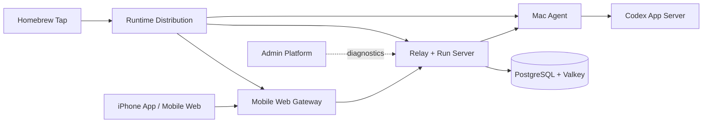

# Codex Remote

Use your phone as a remote workbench for Codex running on your Mac.

Codex Remote is an independent open-source project. It is not affiliated with
or endorsed by OpenAI. Codex and OpenAI are trademarks of their respective
owners.

> [!WARNING]
> Codex Remote is pre-release software. The current public Beta is limited to
> Apple Silicon Macs and same-network iPhone Safari access. It is unsigned,
> not Apple notarized, and must not be exposed directly to the public internet.

## Architecture



The project intentionally uses independent repositories. Cross-repository
integration happens through versioned HTTP, SSE, WebSocket, schema, fixture,
and release-manifest contracts rather than shared source imports.

## Repositories

| Repository | Responsibility |
| --- | --- |
| [iphone-app](https://github.com/codex-remote/iphone-app) | Native SwiftUI iPhone client |
| [mobile-web](https://github.com/codex-remote/mobile-web) | React client and same-origin Gateway |
| [relay-server](https://github.com/codex-remote/relay-server) | Relay, Run Server, Runtime Auth, and contracts |
| [mac-agent](https://github.com/codex-remote/mac-agent) | Local Codex execution and workspace adapter |
| [admin-platform](https://github.com/codex-remote/admin-platform) | Diagnostics server, collector, and admin UI |
| [runtime-distribution](https://github.com/codex-remote/runtime-distribution) | Runtime CLI, supervisor, assembly, and release checks |
| [homebrew-tap](https://github.com/codex-remote/homebrew-tap) | Homebrew installation and public Runtime releases |
| [docs](https://github.com/codex-remote/docs) | Product, architecture, protocol, ADR, and release documentation |

## Install the current Beta

```bash
brew trust --formula codex-remote/tap/codex-remote
brew install codex-remote/tap/codex-remote
codex-remote setup --workspace-root ~/work
codex-remote pair
```

Read the [installation guide](https://github.com/codex-remote/homebrew-tap#quick-start)
and its security limitations before installing.

## Contributing and security

Start with [CONTRIBUTING.md](../CONTRIBUTING.md) and open changes in the
repository that owns the affected component. Report vulnerabilities privately
as described in [SECURITY.md](../SECURITY.md).

All current source repositories are licensed under the
[Apache License 2.0](../LICENSE). Previously published Beta archives retain the
license embedded in those immutable artifacts.
